# Getting Started with Spec Kit Smart

This guide will walk you through installing Spec Kit Smart and building your first feature using Spec-Driven Development.

## Prerequisites

- **Linux, macOS, or Windows**
- **Python 3.11+** ([Download](https://www.python.org/downloads/))
- **Git** ([Download](https://git-scm.com/downloads))
- **AI Coding Agent** (see [Supported AI Agents](../README.md#-supported-ai-agents))

## Step 1: Install Specify CLI

Choose the installation method that best fits your environment:

### Option 1: Persistent Installation (Recommended)

Install once and use everywhere:

```bash
# From public GitHub
pipx install git+https://github.com/veerabhadra-ponna/spec-kit-smart.git

# From GitHub Enterprise (for corporate environments)
pipx install git+https://github.company.com/yourorg/spec-kit-smart.git
```

Then use the tool directly:

```bash
speckitsmart init <PROJECT_NAME>
speckitsmart check
```

To upgrade:

```bash
pipx install --force git+https://github.com/veerabhadra-ponna/spec-kit-smart.git
```

### Option 2: Virtual Environment (No pipx)

When pipx is unavailable, use standard `pip`:

```bash
python -m venv .venv && source .venv/bin/activate  # Windows: .venv\\Scripts\\activate
python -m pip install "spec-kit-smart @ git+https://github.com/veerabhadra-ponna/spec-kit-smart.git"
speckitsmart init <PROJECT_NAME>
```

### Option 3: One-time Usage

Run directly without installing:

```bash
# From public GitHub
pipx run --spec git+https://github.com/veerabhadra-ponna/spec-kit-smart.git speckitsmart init <PROJECT_NAME>

# From GitHub Enterprise
pipx run --spec git+https://github.company.com/yourorg/spec-kit-smart.git speckitsmart init <PROJECT_NAME>
```

### Option 4: Corporate Artifactory (Enterprise)

If your company uses Artifactory PyPI mirror:

```bash
pip config set global.index-url https://artifactory.company.com/artifactory/api/pypi/pypi-virtual/simple
pip install specify-cli
```

**Cross-Platform Support:** All packages include both Bash and PowerShell scripts. AI agents auto-select the correct variant - no manual configuration needed.

## Step 2: Initialize Your Project

Create a new project or initialize in an existing directory:

```bash
# Create new project
speckitsmart init my-project --ai claude

# Initialize in current directory
speckitsmart init --here --ai claude

# Check prerequisites
speckitsmart check
```

The init command will:

- Download the latest templates
- Set up directory structure (`.specify/`, `specs/`, `.guidelines/`)
- Configure your chosen AI agent commands
- Initialize a Git repository (unless `--no-git` is specified)

## Step 3: Building Your First Feature

Now let's build a simple feature using the standard Spec-Driven Development workflow.

### 3.1 Establish Project Principles

Launch your AI assistant in the project directory. The `/speckitsmart.*` commands are now available.

Use `/speckitsmart.constitution` to create your project's governing principles:

```bash
/speckitsmart.constitution Create principles focused on code quality, testing standards, user experience consistency, and performance requirements
```

This creates `.specify/memory/constitution.md` with guidelines that will guide all subsequent development.

### 3.2 Create the Spec

Use `/speckitsmart.specify` to describe what you want to build. Focus on the **what** and **why**, not the tech stack:

```bash
/speckitsmart.specify Build an application that can help me organize my photos in separate photo albums. Albums are grouped by date and can be re-organized by dragging and dropping on the main page. Albums are never in other nested albums. Within each album, photos are previewed in a tile-like interface.
```

The AI agent will:

- Create a feature branch (e.g., `001-photo-albums`)
- Generate `specs/001-photo-albums/spec.md` with user stories and requirements
- Set up the feature directory structure

### 3.3 Create Technical Implementation Plan

Use `/speckitsmart.plan` to provide your tech stack and architecture choices:

```bash
/speckitsmart.plan The application uses Vite with minimal number of libraries. Use vanilla HTML, CSS, and JavaScript as much as possible. Images are not uploaded anywhere and metadata is stored in a local SQLite database.
```

This generates:

- `plan.md` - Implementation strategy
- `research.md` - Technology research
- `data-model.md` - Database schema
- `contracts/` - API specifications

### 3.4 Break Down into Tasks

Use `/speckitsmart.tasks` to create an actionable task list:

```bash
/speckitsmart.tasks
```

This generates `tasks.md` with:

- Task breakdown organized by user story
- Dependency management
- Parallel execution markers
- File path specifications

### 3.5 Execute Implementation

Use `/speckitsmart.implement` to execute all tasks:

```bash
/speckitsmart.implement
```

The AI agent will:

- Parse the task breakdown
- Execute tasks in order, respecting dependencies
- Provide progress updates
- Handle errors appropriately

### 3.6 Workflow Diagram

Here's how the commands flow together:

```mermaid
flowchart LR
    Start([Start]) --> Constitution[🏛️ Constitution<br/>REQUIRED]
    Constitution --> Specify[📝 Specify<br/>REQUIRED]
    Specify --> Clarify[❓ Clarify<br/>OPTIONAL]
    Clarify --> | Recommended | Plan[🏗️ Plan<br/>REQUIRED]
    Clarify -.-> | Skip if clear | Plan
    Plan --> Tasks[📋 Tasks<br/>REQUIRED]
    Tasks --> Analyze[🔍 Analyze<br/>OPTIONAL]
    Analyze --> | Recommended | Implement[⚙️ Implement<br/>REQUIRED]
    Analyze -.-> | Skip if confident | Implement
    Implement --> Checklist[✅ Checklist<br/>OPTIONAL]
    Checklist --> Done([✅ Done])

    style Constitution fill:#ffcccc,stroke:#333,stroke-width:2px
    style Specify fill:#ffcccc,stroke:#333,stroke-width:2px
    style Plan fill:#ffcccc,stroke:#333,stroke-width:2px
    style Tasks fill:#ffcccc,stroke:#333,stroke-width:2px
    style Implement fill:#ffcccc,stroke:#333,stroke-width:2px
    style Clarify fill:#ffffcc,stroke:#333,stroke-width:2px
    style Analyze fill:#ffffcc,stroke:#333,stroke-width:2px
    style Checklist fill:#ffffcc,stroke:#333,stroke-width:2px
    style Start fill:#ccffcc,stroke:#333,stroke-width:2px
    style Done fill:#ccffcc,stroke:#333,stroke-width:2px
```



**Required Commands** (Red):

- `/speckitsmart.constitution` - Establish project principles
- `/speckitsmart.specify` - Define what to build
- `/speckitsmart.plan` - Create technical design
- `/speckitsmart.tasks` - Generate actionable tasks
- `/speckitsmart.implement` - Execute implementation

**Optional Commands** (Yellow):

- `/speckitsmart.clarify` - Resolve ambiguities (recommended before planning)
- `/speckitsmart.analyze` - Validate consistency (recommended before implementation)
- `/speckitsmart.checklist` - Quality validation (recommended after implementation)

## Alternative: Use the Orchestrator

For complex features or multi-session work, use the Orchestrator to run the entire workflow with a single command:

```bash
/speckitsmart.orchestrate Build a photo album application with drag-and-drop organization
```

The Orchestrator:

- Runs all phases automatically (constitution → specify → plan → tasks → implement)
- Saves progress to `.speckitsmart-state.json`
- Enables seamless resumption with `/speckitsmart.resume`
- Handles token limits gracefully

See [Orchestrator Workflow Guide](workflows/orchestrator.md) for details.

## Next Steps

### Explore Advanced Features

- **[Reverse Engineering](reverse-engineering.md)** - Modernize legacy applications
- **[Corporate Guidelines](features/corporate-guidelines.md)** - Enforce company standards
- **[Orchestrator Workflow](workflows/orchestrator.md)** - Automated multi-phase execution

### Learn More

- [CLI Reference](reference/cli-reference.md) - Complete command documentation
- [Supported AI Agents](../README.md#-supported-ai-agents) - Compatible AI tools
- [Troubleshooting](reference/troubleshooting.md) - Common issues and solutions
- [Glossary](../README.md#-glossary) - Key terminology

### Get Help

- [GitHub Issues](https://github.com/veerabhadra-ponna/spec-kit-smart/issues) - Report bugs or request features
- [Documentation](https://veerabhadra-ponna.github.io/spec-kit-smart/) - Full documentation site

## Summary

You've learned how to:

1. ✅ Install Spec Kit Smart
2. ✅ Initialize a project
3. ✅ Build your first feature using Spec-Driven Development
4. ✅ Understand the workflow commands

Now you're ready to build production-quality software faster with Spec Kit Smart!
