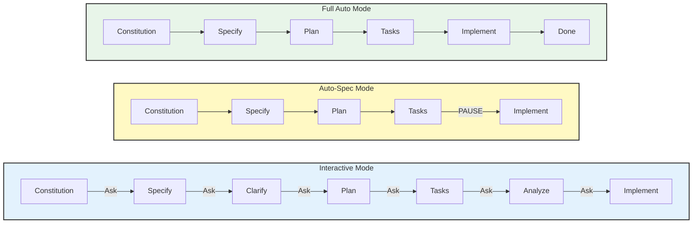
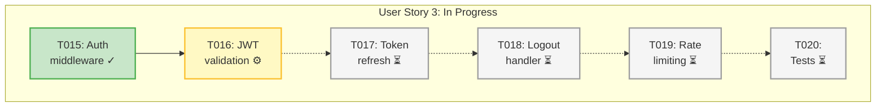

# Orchestrator Workflow

## Overview

The **Orchestrator** workflow simplifies the entire spec-driven development process by managing all phases automatically. Instead of manually invoking each command (constitution → specify → clarify → plan → tasks → analyze → implement), you can run the entire workflow with a single command.

## Why Use the Orchestrator?

**Manual Workflow:** 7 separate commands, manual state tracking, context loss at chat limits.

**Orchestrator Workflow:** `/speckitadv.orchestrate <feature-description>` - 1 command, automatic state management, seamless resumption.

## Key Features

### 1. Single Entry Point

Run the entire workflow from feature description to implementation with one command.

### 2. State-Based Progress Detection

The orchestrator tracks progress via `state.json` in the feature directory (`specs/{feature}/.state/state.json`), enabling:

- Exact stage-level resumption after chat token limits
- Seamless switching between orchestrator and individual commands
- Cross-session continuity with deterministic behavior
- Resume at exact point (no duplicate work, no missed work)

### 3. Flexible Execution Modes



**Interactive Mode** (recommended):

- Asks permission before each major phase
- Allows review and adjustment between phases
- User maintains full control

**Auto-Spec Mode**:

- Runs constitution → specify → plan → tasks automatically
- Pauses before implementation for review

**Full Auto Mode**:

- Runs entire workflow to completion
- Minimal user interaction required

### 4. Context Restoration with `/speckitadv.resume`

Restores context after chat limit: loads all artifacts, identifies stopping point, and continues with zero duplicate work.

## Usage Examples

**Interactive Mode:**

```bash
/speckitadv.orchestrate Build a user authentication system with OAuth2 and JWT
```

Prompts at each phase for user confirmation and review.

**Auto-Spec Mode:**

```bash
/speckitadv.orchestrate --mode=auto-spec Create an analytics dashboard
```

Runs constitution → specify → plan → tasks automatically, pauses before implementation for review.

**Resume After Chat Limit:**

```bash
/speckitadv.resume
```

```mermaid
flowchart LR
    NewChat[New Chat] --> Resume[/resume]
    Resume --> LoadState[Load State]
    LoadState --> LoadArtifacts[Load Artifacts]
    LoadArtifacts --> Identify[Identify<br/>Resume Point]
    Identify --> Summary[Show Summary]
    Summary --> Confirm{Resume?}
    Confirm -->|Yes| Continue[Continue]
    Confirm -->|No| Cancel[Cancel]
    Continue --> Done[Complete]

    style NewChat fill:#e8eaf6,stroke:#333,stroke-width:2px
    style Resume fill:#e1f5e1,stroke:#333,stroke-width:2px
    style LoadState fill:#fff9c4,stroke:#333,stroke-width:2px
    style LoadArtifacts fill:#e3f2fd,stroke:#333,stroke-width:2px
    style Identify fill:#fff4e6,stroke:#333,stroke-width:2px
    style Summary fill:#e8f5e9,stroke:#333,stroke-width:2px
    style Continue fill:#c8e6c9,stroke:#333,stroke-width:2px
    style Done fill:#a5d6a7,stroke:#333,stroke-width:2px
```

Detects progress from artifacts, shows status (e.g., 28/47 tasks), identifies next task, and continues from exact stopping point.

## State-Based Progress Detection

The orchestrator detects progress from `state.json` in the feature directory:

```text
specs/001-user-auth/
├── .state/
│   └── state.json     # Workflow state (maintained by CLI)
├── spec.md            # Created by specify phase
├── plan.md            # Created by plan phase
├── tasks.md           # Created by tasks phase
└── analysis.md        # Created by analyze phase (optional)
```

The CLI reads `state.json` to determine exact workflow and stage. This provides deterministic behavior across all AI models and seamless interoperability between orchestrator and individual commands.

## When to Use Orchestrator vs Individual Commands

- **New features:** Use `/speckitadv.orchestrate`
- **Multi-day workflows:** Use orchestrator + `/speckitadv.resume`
- **Learning:** Use individual commands
- **Re-running phases:** Use individual commands (e.g., `/speckitadv.plan`)
- **Token limits:** Use `/speckitadv.resume`

## Best Practices

- **Commit frequently** during long workflows
- **Review before implementation** using interactive or auto-spec mode
- **Commit artifacts** for cross-machine work
- **Use `/speckitadv.resume`** after token limits or errors

## Progress Visualization

**Task-Level Progress:**



**Legend:**

- ✓ = Completed
- ⚙ = In Progress (current task)
- ⏳ = Pending
- ⏭ = Skipped

## Error Handling

If any phase fails:

```text
❌ Error in phase: implement

Error details: Module 'stripe' not found

Your progress has been saved.

To resume after fixing the issue:
  /speckitadv.resume

To start fresh:
  /speckitadv.orchestrate <feature-description>
```

Simply fix the issue (e.g., `npm install stripe`) and run `/speckitadv.resume` to continue.

## Workflow Diagram (Orchestrator)

```mermaid
flowchart LR
    Start([/orchestrate]) --> Constitution[Constitution]
    Constitution --> Specify[Specify]
    Specify --> Clarify[Clarify]
    Clarify --> Plan[Plan]
    Plan --> Tasks[Tasks]
    Tasks --> Analyze[Analyze]
    Analyze --> Implement[Implement]
    Implement --> Done([Done])

    Artifacts[specs/feature/]
    Specify -.-> Artifacts
    Plan -.-> Artifacts
    Tasks -.-> Artifacts
    Analyze -.-> Artifacts

    Artifacts -.-> Resume[/resume]
    Resume -.-> |Detect & Restore| Constitution

    style Start fill:#e1f5e1,stroke:#333,stroke-width:2px
    style Done fill:#e1f5e1,stroke:#333,stroke-width:2px
    style Constitution fill:#fff4e6,stroke:#333,stroke-width:2px
    style Specify fill:#e3f2fd,stroke:#333,stroke-width:2px
    style Clarify fill:#f3e5f5,stroke:#333,stroke-width:2px
    style Plan fill:#e8f5e9,stroke:#333,stroke-width:2px
    style Tasks fill:#fff9c4,stroke:#333,stroke-width:2px
    style Analyze fill:#fce4ec,stroke:#333,stroke-width:2px
    style Implement fill:#e0f2f1,stroke:#333,stroke-width:2px
    style State fill:#fff3e0,stroke:#333,stroke-width:2px
    style Resume fill:#e8eaf6,stroke:#333,stroke-width:2px
```

## Summary

One-command execution, automatic state management, zero context loss, flexible modes, cross-session continuity, error recovery, and progress transparency.

```bash
/speckitadv.orchestrate <your-feature-description>
```

## Related Documentation

- [Getting Started Guide](../getting-started.md)
- [Standard Workflow](../README.md#workflow-diagram-spec-driven-development)
- [Troubleshooting](../reference/troubleshooting.md)
