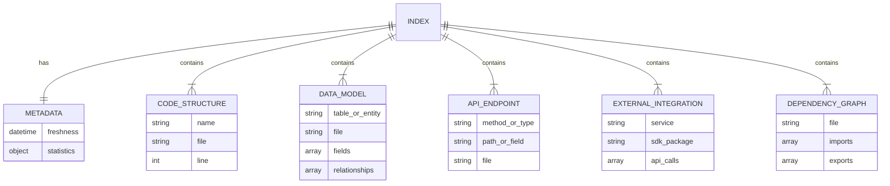

# Data Model: Codebase Indexing System

**Feature**: C00000-0001-codebase-indexing
**Date**: 2025-01-25
**Status**: Phase 1 Complete

## Overview

This document defines the data structures for the codebase indexing system. All data is stored as JSON files in the `.analysis/index/` directory for fast local access and queryability.

---

## Entity Definitions

### 1. Index (Container)

**Purpose**: Root container for all indexed data

**Storage**: Distributed across 6 JSON files in `.analysis/index/`

**Properties**:
- **version**: String (const: "1.0") - Index format version
- **timestamp**: ISO 8601 datetime - When index was created
- **index_type**: Enum ("full", "incremental") - Type of index build

**Relationships**:
- `has_one` Metadata
- `has_many` Code Structures
- `has_many` Data Models
- `has_many` API Endpoints
- `has_many` External Integrations
- `has_many` Dependencies

---

### 2. Metadata

**Purpose**: Track index freshness, statistics, and build information

**Storage**: `metadata.json`

**Schema**:

```json
{
  "version": "1.0",
  "generated_at": "2025-01-25T10:30:58Z",
  "freshness": "2025-01-25T10:30:58Z",
  "index_type": "full",
  "duration_seconds": 42.5,
  "statistics": {
    "total_files": 189,
    "indexed_files": 188,
    "skipped_files": 1,
    "total_classes": 45,
    "total_functions": 312,
    "total_interfaces": 67,
    "total_entities": 23,
    "total_rest_endpoints": 45,
    "total_graphql_resolvers": 12,
    "total_external_services": 5
  },
  "languages": {
    "typescript": 145,
    "javascript": 32,
    "json": 12
  },
  "exclusions": ["node_modules/**", "dist/**", "*.test.ts"]
}
```

**Fields**:
- **version** (string, required): Index format version (currently "1.0")
- **generated_at** (datetime, required): ISO 8601 timestamp of index creation
- **freshness** (datetime, required): Same as generated_at, used for staleness checks
- **index_type** (enum, required): "full" or "incremental"
- **duration_seconds** (number): Time taken to build index
- **statistics** (object, required): Aggregate counts
  - **total_files** (integer): Total files discovered
  - **indexed_files** (integer): Successfully indexed files
  - **skipped_files** (integer): Files skipped (too large, parse errors, binary)
  - **total_classes** (integer): Classes found
  - **total_functions** (integer): Functions found
  - **total_interfaces** (integer): Interfaces/types found
  - **total_entities** (integer): Database entities found
  - **total_rest_endpoints** (integer): REST API routes found
  - **total_graphql_resolvers** (integer): GraphQL resolvers found
  - **total_external_services** (integer): Third-party services detected
- **languages** (object): File count by language (key: language, value: count)
- **exclusions** (array of strings): Glob patterns excluded from indexing

**Validation Rules**:
- `version` must be "1.0"
- `generated_at` and `freshness` must be valid ISO 8601 timestamps
- All count fields must be non-negative integers
- `indexed_files + skipped_files` should equal `total_files`

---

### 3. Code Structure

**Purpose**: Represent classes, functions, and interfaces extracted from source code

**Storage**: `structure.json`

**Schema**:

```json
{
  "version": "1.0",
  "timestamp": "2025-01-25T10:30:58Z",
  "classes": [
    {
      "name": "User",
      "file": "src/models/User.ts",
      "line": 12,
      "methods": ["constructor", "save", "delete", "validate", "toJSON"],
      "extends": "BaseModel",
      "implements": ["IUser", "Serializable"]
    }
  ],
  "functions": [
    {
      "name": "validateEmail",
      "file": "src/utils/validation.ts",
      "line": 45,
      "parameters": ["email"],
      "return_type": "boolean"
    }
  ],
  "interfaces": [
    {
      "name": "IUser",
      "file": "src/types/user.ts",
      "line": 5,
      "fields": [
        {"name": "id", "type": "string", "optional": false},
        {"name": "email", "type": "string", "optional": false},
        {"name": "name", "type": "string", "optional": true}
      ]
    }
  ]
}
```

**Entity: Class**

**Fields**:
- **name** (string, required): Class name
- **file** (string, required): Relative path from repo root
- **line** (integer): Line number where class is defined
- **methods** (array of strings): Method names
- **extends** (string): Parent class name (if applicable)
- **implements** (array of strings): Interface names (if applicable)

**Entity: Function**

**Fields**:
- **name** (string, required): Function name
- **file** (string, required): Relative path from repo root
- **line** (integer): Line number where function is defined
- **parameters** (array of strings): Parameter names
- **return_type** (string): Return type (if determinable)

**Entity: Interface**

**Fields**:
- **name** (string, required): Interface name
- **file** (string, required): Relative path from repo root
- **line** (integer): Line number where interface is defined
- **fields** (array of objects): Interface fields
  - **name** (string): Field name
  - **type** (string): Field type
  - **optional** (boolean): Whether field is optional

**Validation Rules**:
- `file` paths must be relative to repository root (no leading `/`)
- `line` numbers must be positive integers
- `name` must be non-empty string
- Array fields default to empty array `[]` if not present

---

### 4. Data Model

**Purpose**: Represent database schemas and ORM entities

**Storage**: `data-models.json`

**Schema**:

```json
{
  "version": "1.0",
  "timestamp": "2025-01-25T10:30:58Z",
  "database_schemas": [
    {
      "table": "users",
      "file": "prisma/schema.prisma",
      "columns": [
        {
          "name": "id",
          "type": "String",
          "nullable": false,
          "unique": true,
          "primary_key": true,
          "default": null
        },
        {
          "name": "email",
          "type": "String",
          "nullable": false,
          "unique": true,
          "primary_key": false,
          "default": null
        },
        {
          "name": "created_at",
          "type": "DateTime",
          "nullable": false,
          "unique": false,
          "primary_key": false,
          "default": "now()"
        }
      ],
      "relationships": [
        {
          "type": "hasMany",
          "target": "orders",
          "foreign_key": "user_id"
        }
      ]
    }
  ],
  "orm_entities": [
    {
      "entity": "User",
      "table": "users",
      "file": "src/entities/User.ts",
      "fields": [
        {"name": "id", "type": "string", "nullable": false},
        {"name": "email", "type": "string", "nullable": false},
        {"name": "name", "type": "string", "nullable": true}
      ],
      "decorators": ["@Entity('users')"],
      "relationships": [
        {
          "type": "OneToMany",
          "target": "Order",
          "field": "orders"
        }
      ]
    }
  ],
  "type_definitions": [
    {
      "name": "UserDTO",
      "file": "src/types/user.ts",
      "fields": [
        {"name": "id", "type": "string"},
        {"name": "email", "type": "string"},
        {"name": "name", "type": "string | null"}
      ]
    }
  ]
}
```

**Entity: Database Schema**

**Fields**:
- **table** (string, required): Database table name
- **file** (string, required): Schema definition file path
- **columns** (array of objects, required): Table columns
  - **name** (string): Column name
  - **type** (string): Column type (String, Integer, DateTime, etc.)
  - **nullable** (boolean): Whether NULL values allowed
  - **unique** (boolean): Whether column has unique constraint
  - **primary_key** (boolean): Whether column is primary key
  - **default** (string|number|null): Default value
- **relationships** (array of objects): Foreign key relationships
  - **type** (enum): "hasMany", "belongsTo", "hasOne", "manyToMany"
  - **target** (string): Target table name
  - **foreign_key** (string): Foreign key column name

**Entity: ORM Entity**

**Fields**:
- **entity** (string, required): Entity class name
- **table** (string, required): Mapped database table name
- **file** (string, required): Entity file path
- **fields** (array of objects): Entity fields
  - **name** (string): Field name
  - **type** (string): Field type
  - **nullable** (boolean): Whether field can be null
- **decorators** (array of strings): ORM decorators (@Entity, @Column, etc.)
- **relationships** (array of objects): ORM relationships
  - **type** (enum): "OneToMany", "ManyToOne", "OneToOne", "ManyToMany"
  - **target** (string): Target entity name
  - **field** (string): Relationship field name

**Entity: Type Definition**

**Fields**:
- **name** (string, required): Type/interface name
- **file** (string, required): Type definition file path
- **fields** (array of objects): Type fields
  - **name** (string): Field name
  - **type** (string): Field type

**Validation Rules**:
- `table` names must match pattern `[a-z_]+`
- Column types must be valid database types
- Relationship targets must reference existing tables/entities
- Foreign keys must reference actual columns

---

### 5. API Endpoint

**Purpose**: Represent REST, GraphQL, and WebSocket endpoints

**Storage**: `api-endpoints.json`

**Schema**:

```json
{
  "version": "1.0",
  "timestamp": "2025-01-25T10:30:58Z",
  "rest_endpoints": [
    {
      "method": "POST",
      "path": "/api/auth/login",
      "handler": "authController.login",
      "file": "src/routes/auth.ts",
      "line": 12,
      "middleware": ["validateBody", "rateLimit"],
      "request_schema": {
        "email": "string",
        "password": "string"
      },
      "response_schema": {
        "token": "string",
        "user": "User"
      },
      "authentication": "none"
    }
  ],
  "graphql_resolvers": [
    {
      "type": "Query",
      "field": "user",
      "file": "src/resolvers/user.ts",
      "line": 25,
      "arguments": [
        {"name": "id", "type": "ID!"}
      ],
      "return_type": "User"
    }
  ],
  "websocket_handlers": [
    {
      "event": "message:send",
      "handler": "messageHandler.onSend",
      "file": "src/sockets/message.ts",
      "line": 45
    }
  ]
}
```

**Entity: REST Endpoint**

**Fields**:
- **method** (enum, required): "GET", "POST", "PUT", "PATCH", "DELETE"
- **path** (string, required): URL path (e.g., "/api/users/:id")
- **handler** (string, required): Handler function name
- **file** (string, required): Route definition file path
- **line** (integer): Line number of route definition
- **middleware** (array of strings): Middleware function names
- **request_schema** (object): Request body schema (key: field, value: type)
- **response_schema** (object): Response body schema (key: field, value: type)
- **authentication** (enum): "none", "jwt", "session", "api_key", "oauth2"

**Entity: GraphQL Resolver**

**Fields**:
- **type** (enum, required): "Query", "Mutation", "Subscription"
- **field** (string, required): Resolver field name
- **file** (string, required): Resolver file path
- **line** (integer): Line number
- **arguments** (array of objects): Resolver arguments
  - **name** (string): Argument name
  - **type** (string): GraphQL type (e.g., "ID!", "String", "[User]")
- **return_type** (string): GraphQL return type

**Entity: WebSocket Handler**

**Fields**:
- **event** (string, required): Socket event name
- **handler** (string, required): Handler function name
- **file** (string, required): Handler file path
- **line** (integer): Line number

**Validation Rules**:
- REST `method` must be valid HTTP method
- REST `path` must start with `/`
- GraphQL types must follow GraphQL type syntax
- Event names must be non-empty strings

---

### 6. External Integration

**Purpose**: Track third-party service usage and dependencies

**Storage**: `external-apis.json`

**Schema**:

```json
{
  "version": "1.0",
  "timestamp": "2025-01-25T10:30:58Z",
  "third_party_services": [
    {
      "service": "Stripe",
      "sdk_package": "stripe",
      "version": "^12.0.0",
      "api_calls": [
        {
          "method": "stripe.customers.create",
          "file": "src/services/billing.ts",
          "line": 45
        },
        {
          "method": "stripe.charges.create",
          "file": "src/services/billing.ts",
          "line": 78
        }
      ]
    }
  ],
  "environment_variables": [
    {
      "name": "STRIPE_SECRET_KEY",
      "required": true,
      "file": "src/config/stripe.ts",
      "line": 12
    },
    {
      "name": "DATABASE_URL",
      "required": true,
      "file": "src/config/database.ts",
      "line": 8
    }
  ]
}
```

**Entity: Third-Party Service**

**Fields**:
- **service** (string, required): Service name (e.g., "Stripe", "AWS", "SendGrid")
- **sdk_package** (string, required): NPM/PyPI/Maven package name
- **version** (string): Package version or version range
- **api_calls** (array of objects): API method calls
  - **method** (string): API method name (e.g., "stripe.customers.create")
  - **file** (string): File containing API call
  - **line** (integer): Line number of API call

**Entity: Environment Variable**

**Fields**:
- **name** (string, required): Environment variable name
- **required** (boolean): Whether variable is required for app to function
- **file** (string): File where variable is referenced
- **line** (integer): Line number of reference

**Validation Rules**:
- Service names must match known services list (extensible)
- Environment variable names must match pattern `[A-Z_]+`
- Package names must be valid for respective package manager

---

### 7. Dependency Graph

**Purpose**: Track import/export relationships between files

**Storage**: `dependencies.json`

**Schema**:

```json
{
  "version": "1.0",
  "timestamp": "2025-01-25T10:30:58Z",
  "files": [
    {
      "file": "src/services/user.ts",
      "imports": [
        {"from": "src/models/User.ts", "symbols": ["User"]},
        {"from": "src/utils/validation.ts", "symbols": ["validateEmail"]},
        {"from": "stripe", "symbols": ["Stripe"], "external": true}
      ],
      "exports": [
        {"symbol": "UserService", "type": "class"},
        {"symbol": "createUser", "type": "function"},
        {"symbol": "deleteUser", "type": "function"}
      ]
    }
  ]
}
```

**Entity: File Dependency**

**Fields**:
- **file** (string, required): File path (relative to repo root)
- **imports** (array of objects): Imported dependencies
  - **from** (string): Source file/package
  - **symbols** (array of strings): Imported symbol names
  - **external** (boolean): Whether import is from external package (default: false)
- **exports** (array of objects): Exported symbols
  - **symbol** (string): Export name
  - **type** (enum): "class", "function", "interface", "const", "type"

**Validation Rules**:
- Import `from` paths must be valid file paths or package names
- Export symbols must match extracted classes/functions/interfaces
- Circular dependency detection (informational warning, not error)

---

## Relationships



---

## Indexing Rules

### File Path Conventions

- All file paths stored as **relative paths** from repository root
- Use forward slashes `/` even on Windows (normalized)
- No leading `/` (e.g., `src/models/User.ts` not `/src/models/User.ts`)

### Line Number Conventions

- Line numbers are **1-indexed** (first line = line 1)
- Negative or zero line numbers are invalid
- Line numbers are **optional** (may be null if not determinable)

### Secret Redaction

- API keys, passwords, tokens redacted before storage
- Redaction pattern: `***REDACTED***` for values
- Environment variable **names** preserved, **values** redacted

### Null/Empty Handling

- Optional fields omitted from JSON (not stored as null)
- Empty arrays stored as `[]`
- Empty objects stored as `{}`

---

## Storage Considerations

**File Size**:
- Target: <1% of codebase size [SC-011]
- Typical: 1-10MB for medium projects (1K-10K files)

**Atomic Writes**:
- Use temporary files + rename for atomicity
- Prevents corrupted index if write fails mid-operation

**Permissions**:
- `.analysis/` directory: 700 (owner only)
- Index JSON files: 600 (owner read/write only)

**Gitignore**:
- `.analysis/` automatically added to .gitignore
- Prevents accidental commits of generated index

---

## Phase 1 Summary

**Entities Defined**: 7 core entities (Index, Metadata, Code Structure, Data Model, API Endpoint, External Integration, Dependency Graph)

**Storage Format**: JSON files (6 domain files)

**Validation**: JSON Schema validation + business rule validation

**Next Phase**: Contract generation (JSON schemas in `contracts/` directory)
