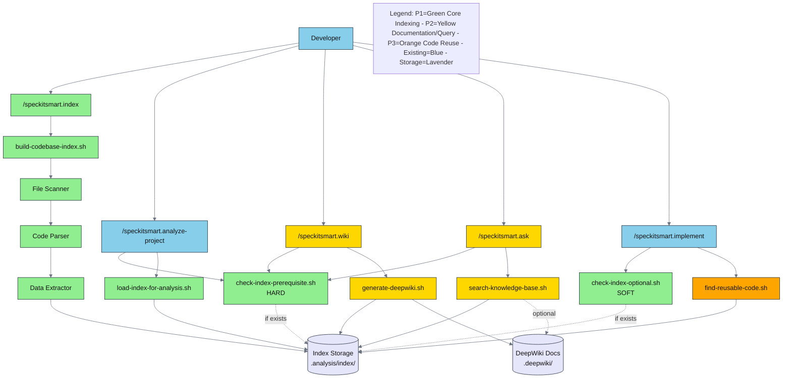
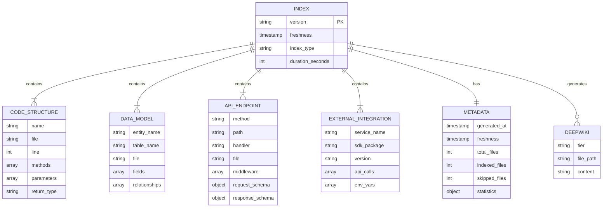
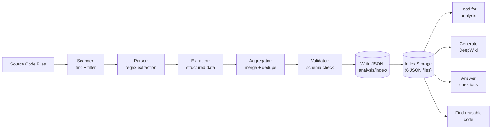

# Implementation Plan: Codebase Indexing System

**Branch**: `feature/C00000-0001-codebase-indexing` | **Date**: 2025-01-25 | **Spec**: [spec.md](./spec.md)
**Input**: Feature specification from `/specs/C00000-0001-codebase-indexing/spec.md`

## Summary

Build a codebase indexing system that creates searchable representations of code structure, data models, API endpoints, and external integrations. The system provides slash commands for building indexes (`/speckitsmart.index`), generating documentation (`/speckitsmart.wiki`), querying codebases (`/speckitsmart.ask`), and enhancing reverse engineering (`/speckitsmart.analyze-project`) and implementation (`/speckitsmart.implement`) workflows with automatic code reusability detection.

**Key Benefits:**
- 10x faster reverse engineering (2-5 min vs 20-50 min for 10K file codebase)
- 80% token reduction using pre-extracted data instead of full file reads
- 40-60% code reuse through automatic duplicate detection
- <60 seconds index build time for typical projects (1K-10K files)

**Technical Approach:** Bash/PowerShell scripts for cross-platform support, JSON-based index storage in `.analysis/index/`, regex-based parsing with tree-sitter planned for Phase 2, prerequisite check system for hard/soft dependencies.

## Technical Context

**Language/Version**: Bash 4.0+ (Unix/Linux/macOS), PowerShell 5.1+ (Windows)

**Primary Dependencies**:

**Unix/Linux/macOS (Bash)**:
- `jq` - JSON processing (prerequisite check, data aggregation)
- `git` - Repository root detection (fallback to `pwd` if not available)
- Standard Unix tools: `find`, `grep`, `sed`, `awk`, `date` (built-in)
- `tree-sitter` - AST parsing (Phase 2 - Phase 1 uses regex fallback)

**Windows (PowerShell)**:
- `jq` - JSON processing (Windows binary or via chocolatey/scoop)
- `git` - Repository root detection (Git for Windows provides git.exe)
- PowerShell 5.1+ built-ins: `Get-ChildItem`, `Select-String`, `-replace` operator (equivalent to Unix tools)
- `tree-sitter` - AST parsing (Phase 2 - Phase 1 uses PowerShell regex)

**Cross-Platform Notes**:
- **jq**: Must be installed on all platforms (scripts check at startup)
  - macOS: `brew install jq`
  - Linux: `apt-get install jq` or `yum install jq`
  - Windows: `choco install jq` or download from <https://jqlang.github.io/jq/>
- **git**: Optional (fallback to current directory if not available)
- **Unix tools equivalents in PowerShell**:
  - `find` → `Get-ChildItem -Recurse`
  - `grep` → `Select-String`
  - `sed` → `-replace` operator
  - `awk` → `ForEach-Object` with string manipulation
  - `date` → `Get-Date`

**Storage**: File-based JSON storage in `.analysis/index/` directory
- structure.json - Code elements (classes, functions, interfaces)
- data-models.json - Database schemas and ORM entities
- api-endpoints.json - REST/GraphQL/WebSocket endpoints
- external-apis.json - Third-party service integrations
- dependencies.json - Import/export graphs
- metadata.json - Statistics and freshness tracking

**Testing**: Bash test framework (bats) for unit tests, integration test scripts for cross-platform validation

**Target Platform**: Cross-platform CLI tool (Linux, macOS, Windows)

**Project Type**: CLI tooling / Developer productivity framework

**Performance Goals**:
- Index build: <10s (<1K files), <60s (1K-10K files), <5min (10K-50K files) [SC-001, FR-058]
- Incremental updates: <5s for single file changes [SC-002, FR-059]
- Query response: <5s per question (95th percentile) [SC-007]
- DeepWiki generation: <2min for typical projects [SC-008]

**Constraints**:
- Memory usage: <500MB for codebases up to 50K files [SC-012]
- Index storage: <1% of codebase size [SC-011]
- No external API dependencies (all processing local)
- Index files local-only (never uploaded, automatically gitignored)
- No real-time index updates (manual rebuild/incremental update required)

**Scale/Scope**:
- Small projects: <1K files (5-10s index build)
- Medium projects: 1K-10K files (30-60s index build)
- Large projects: 10K-50K files (2-5min index build)
- Maximum file size: 10MB (larger files skipped with warnings)

**Version Selection Notes**: Bash 4.0+ is widely available on modern Unix systems (Ubuntu 18.04+, macOS 10.15+). PowerShell 5.1+ is bundled with Windows 10+. jq 1.6+ selected for stable JSON processing features.

## Constitution Check

*GATE: Must pass before Phase 0 research. Re-check after Phase 1 design.*

**Constitution Status**: Constitution file contains only template placeholders - no active principles to validate against.

**Default Best Practices Applied**:
- ✅ **Simplicity**: Using bash/PowerShell scripts (not introducing new runtimes/languages)
- ✅ **CLI-first**: All commands exposed via slash commands with JSON output
- ✅ **Cross-platform**: Dual implementation (bash + PowerShell) for Unix/Windows
- ✅ **Local-only**: No cloud dependencies, all processing happens locally
- ✅ **Testability**: Scripts designed for unit and integration testing
- ✅ **Observability**: JSON structured output, verbose mode for debugging

**No violations detected** - design aligns with industry best practices for CLI tooling.

## Project Structure

### Documentation (this feature)

```text
specs/C00000-0001-codebase-indexing/
├── plan.md              # This file (/speckitsmart.plan command output)
├── research.md          # Phase 0 output (/speckitsmart.plan command)
├── data-model.md        # Phase 1 output (/speckitsmart.plan command)
├── quickstart.md        # Phase 1 output (/speckitsmart.plan command)
├── contracts/           # Phase 1 output (/speckitsmart.plan command)
│   ├── index-output-schema.json
│   ├── prerequisite-check-schema.json
│   ├── metadata-schema.json
│   └── structure-schema.json
└── tasks.md             # Phase 2 output (/speckitsmart.tasks command - NOT created by /speckitsmart.plan)
```

### Source Code (repository root)

This feature adds new scripts and command templates to the existing Spec Kit Smart repository:

```text
.claude/commands/
├── index.md             # NEW: /speckitsmart.index slash command
├── wiki.md              # NEW: /speckitsmart.wiki slash command
└── ask.md               # NEW: /speckitsmart.ask slash command

.specify/
├── scripts/
│   ├── bash/
│   │   ├── build-codebase-index.sh             # NEW: Core indexing script
│   │   ├── check-index-prerequisite.sh         # NEW: Hard prerequisite check
│   │   ├── check-index-optional.sh             # NEW: Soft prerequisite check
│   │   ├── load-index-for-analysis.sh          # NEW: Load index data
│   │   ├── find-reusable-code.sh               # NEW: Code reusability search
│   │   ├── generate-deepwiki.sh                # NEW: Documentation generator
│   │   └── search-knowledge-base.sh            # NEW: Q&A query engine
│   │
│   └── powershell/
│       ├── Build-CodebaseIndex.ps1             # NEW: PowerShell equivalent
│       ├── Check-IndexPrerequisite.ps1         # NEW: PowerShell equivalent
│       ├── Check-IndexOptional.ps1             # NEW: PowerShell equivalent
│       ├── Load-IndexForAnalysis.ps1           # NEW: PowerShell equivalent
│       ├── Find-ReusableCode.ps1               # NEW: PowerShell equivalent
│       ├── Generate-DeepWiki.ps1               # NEW: PowerShell equivalent
│       └── Search-KnowledgeBase.ps1            # NEW: PowerShell equivalent
│
├── templates/
│   └── AGENTS.md         # MODIFIED: Add indexing section
│
└── memory/
    └── indexing-patterns.md  # NEW: Extraction patterns reference

tests/
├── indexing/
│   ├── test-prerequisite-checks.sh     # NEW: Prerequisite check tests
│   ├── test-index-building.sh          # NEW: Index build tests
│   ├── test-data-extraction.sh         # NEW: Extraction algorithm tests
│   ├── test-incremental-update.sh      # NEW: Incremental update tests
│   └── test-cross-platform.sh          # NEW: Cross-platform tests
│
└── fixtures/
    └── sample-projects/                # NEW: Test fixture projects
        ├── typescript-express/
        ├── python-fastapi/
        └── java-spring-boot/

.analysis/                  # NEW: Generated at runtime (gitignored)
└── index/                  # Index storage directory
    ├── structure.json
    ├── data-models.json
    ├── api-endpoints.json
    ├── external-apis.json
    ├── dependencies.json
    ├── metadata.json
    └── cache/
        ├── file-hashes.json
        └── last-run.json

.deepwiki/                  # NEW: Generated by /speckitsmart.wiki (gitignored)
├── index.md
├── overview.md
├── functional-summary.md
├── architecture/
├── modules/
└── api-reference/
```

**Structure Decision**: Single project structure (bash/PowerShell scripts). This is a tooling enhancement to the existing Spec Kit Smart framework, not a standalone application. All scripts follow established patterns from `.specify/scripts/` directory.

## Complexity Tracking

> **No violations - table not needed**

Constitution check passed with no complexity violations. Design follows simplicity principles using standard shell scripting without additional frameworks or abstractions.

---

## High-Level Architecture

### Component Interaction Diagram

**Purpose**: Show how indexing features integrate with existing Spec Kit Smart commands



### Architecture Pattern

**Pattern Used**: **Layered CLI Architecture** with **Command-Script-Processor separation**

**Layers:**
1. **Command Layer**: Slash commands in `.claude/commands/` (user interface)
2. **Orchestration Layer**: Bash/PowerShell scripts (cross-platform logic)
3. **Processing Layer**: Extraction algorithms (data transformation)
4. **Storage Layer**: JSON files in `.analysis/index/` (persistence)

**Justification**:
- **Simplicity**: Each layer has clear responsibility without complex abstractions
- **Testability**: Scripts can be tested independently from slash commands
- **Cross-platform**: Platform-specific logic isolated to bash/PowerShell implementations
- **Maintainability**: Clear separation allows parallel development of features

**Trade-offs**:
- **Optimizing for**: Simplicity, maintainability, cross-platform compatibility
- **Trade-off**: Performance (single-threaded in Phase 1) vs complexity (no parallelization framework needed)
- **Trade-off**: Regex parsing (Phase 1) vs AST accuracy (tree-sitter in Phase 2) for faster initial delivery

### Component Responsibilities

| Component | Responsibility | New/Modified | Phase | Location |
|-----------|----------------|--------------|-------|----------|
| `/speckitsmart.index` | User interface for index building | New | P1 | `.claude/commands/index.md` |
| `build-codebase-index.sh` | Core indexing orchestration, file scanning, extraction coordination | New | P1 | `.specify/scripts/bash/` |
| `check-index-prerequisite.sh` | Hard prerequisite validation (fail if missing) | New | P1 | `.specify/scripts/bash/` |
| `check-index-optional.sh` | Soft prerequisite check (warn but continue) | New | P1 | `.specify/scripts/bash/` |
| `load-index-for-analysis.sh` | Load and aggregate index data for analysis | New | P1 | `.specify/scripts/bash/` |
| File Scanner | Discover source files, filter by language/pattern | New | P1 | Embedded in build-codebase-index.sh |
| Code Parser | Extract classes, functions, interfaces via regex | New | P1 | Embedded in build-codebase-index.sh |
| Data Extractor | Extract data models (Prisma, TypeORM, etc.) | New | P1 | Embedded in build-codebase-index.sh |
| API Extractor | Extract REST/GraphQL endpoints | New | P1 | Embedded in build-codebase-index.sh |
| Dependency Analyzer | Build import/export graphs | New | P1 | Embedded in build-codebase-index.sh |
| `/speckitsmart.wiki` | User interface for documentation generation | New | P2 | `.claude/commands/wiki.md` |
| `generate-deepwiki.sh` | Generate 4-tier documentation from index | New | P2 | `.specify/scripts/bash/` |
| `/speckitsmart.ask` | User interface for Q&A | New | P2 | `.claude/commands/ask.md` |
| `search-knowledge-base.sh` | Natural language query engine | New | P2 | `.specify/scripts/bash/` |
| `find-reusable-code.sh` | Search index for similar implementations | New | P3 | `.specify/scripts/bash/` |
| `/speckitsmart.analyze-project` | Add prerequisite check before execution | Modified | P1 | `.claude/commands/analyze-project.md` |
| `/speckitsmart.implement` | Add optional reusability checks | Modified | P1 | `.claude/commands/implement.md` |
| `AGENTS.md` | Add indexing features documentation | Modified | P1 | `.specify/templates/AGENTS.md` |

---

## Cross-Cutting Concerns

### Error Handling

**Strategy**: Fail fast for hard prerequisites, graceful degradation for optional features

**Error Response Format** (JSON output from scripts):

```json
{
  "success": false,
  "error": {
    "code": "INDEX_NOT_FOUND",
    "message": "Codebase index not found at .analysis/index",
    "details": "Run /speckitsmart.index to build the index first",
    "remediation": "Estimated time: 30-60 seconds for typical projects"
  }
}
```

**Error Codes**:
- `INDEX_NOT_FOUND` - Index directory missing (hard prerequisite)
- `INDEX_CORRUPTED` - metadata.json missing or invalid (hard prerequisite)
- `INDEX_STALE` - Index >7 days old (warning, not error)
- `PARSE_FAILED` - File parsing failed (continue with other files)
- `FILE_TOO_LARGE` - File exceeds 10MB limit (skip with warning)
- `MISSING_DEPENDENCY` - jq or git not found (installation required)
- `PERMISSION_DENIED` - Cannot write to .analysis/ directory

**Logging Strategy**:
- **Default mode**: Minimal output (success/failure summary)
- **Verbose mode** (`--verbose` flag): Detailed progress, file-by-file logging
- **What to log**: Files processed, extraction counts, skipped files, warnings, errors
- **Log format**: Plain text to stdout (human-readable), JSON for structured parsing
- **Error logging**: All errors to stderr with exit codes

**Exit Codes**:
- `0` - Success
- `1` - Hard prerequisite failure (index missing)
- `2` - Dependency missing (jq, git)
- `3` - Permission error
- `4` - Invalid arguments
- `5` - Partial success (some files failed, but index created)

### Security

**Authentication**: N/A (local CLI tool, no network access)

**Authorization**: File system permissions only

**Data Protection**:
- **No encryption in transit**: All operations local (no network)
- **No encryption at rest**: Index stored as plain JSON (local file system permissions apply)
- **Secret redaction**: Automatic detection and redaction of common patterns before indexing:
  - API keys: `API_KEY=***REDACTED***`
  - Passwords: `PASSWORD=***REDACTED***`
  - JWT tokens: `***JWT_REDACTED***`
  - Environment variable values (names kept, values redacted)

**Input Validation**:
- **Where**: Argument parsing in bash/PowerShell scripts
- **Method**: Whitelist validation for flags, path sanitization for directory arguments
- **Sanitization**: Remove `..` from paths, reject absolute paths outside repo root

**Secret Redaction Patterns** (FR-015):

```bash
redact_secrets() {
    local content="$1"

    # Redact API keys, secrets, passwords
    content=$(echo "$content" | sed -E 's/(API_KEY|SECRET|PASSWORD)[[:space:]]*=[[:space:]]*['\''"]([^'\''"]+)['\''"]/\1=***REDACTED***/g')

    # Redact JWT tokens
    content=$(echo "$content" | sed -E 's/eyJ[A-Za-z0-9_-]+\.[A-Za-z0-9_-]+\.[A-Za-z0-9_-]+/***JWT_REDACTED***/g')

    # Redact common credential patterns
    content=$(echo "$content" | sed -E 's/(token|auth|bearer)[[:space:]]*:[[:space:]]*['\''"]([^'\''"]+)['\''"]/\1: "***REDACTED***/g')

    echo "$content"
}
```

**Access Control**:
- `.analysis/` directory permissions: `700` (owner read/write/execute only)
- Index files readable only by owner
- No network access (all processing local)

**Security Guarantees**:
- Index never uploaded to external services
- No telemetry or analytics
- Respects `.gitignore` patterns
- Automatic gitignore entry for `.analysis/` and `.deepwiki/`

### Observability

**Logging**:
- **Format**: Plain text (default), JSON with `--json` flag
- **Fields**: timestamp, level (INFO/WARN/ERROR), message, component, file_count, duration
- **Destination**: stdout (success/info), stderr (warnings/errors)

**Example Output** (default mode):

```
Building codebase index...
Found 189 files (TypeScript: 145, JavaScript: 32, JSON: 12)
Extracting code structure... 45 classes, 312 functions, 67 interfaces
Extracting data models... 23 entities, 5 Prisma schemas
Extracting API endpoints... 45 REST routes, 12 GraphQL resolvers
Extracting external APIs... 5 services (Stripe, AWS, SendGrid, Auth0, Twilio)
Building dependency graph... 189 files, 892 imports

✓ Index built successfully in 42 seconds
✓ Files indexed: 189
✓ Index size: 2.4 MB
✓ Location: .analysis/index/

Next steps:
  - Generate documentation: /speckitsmart.wiki
  - Query codebase: /speckitsmart.ask "your question"
  - Analyze project: /speckitsmart.analyze-project
```

**Example Output** (verbose mode):

```
[2025-01-25 10:30:15] INFO: Starting codebase index build (full mode)
[2025-01-25 10:30:15] INFO: Scanning for source files...
[2025-01-25 10:30:16] INFO: Found 189 files to index
[2025-01-25 10:30:16] INFO: Processing src/models/User.ts...
[2025-01-25 10:30:16] INFO:   Extracted class: User (5 methods)
[2025-01-25 10:30:16] INFO:   Extracted entity: @Entity("users") with 8 fields
[2025-01-25 10:30:16] WARN:   Large file (15MB): src/generated/schema.ts - SKIPPED
[2025-01-25 10:30:17] INFO: Processing src/routes/auth.ts...
[2025-01-25 10:30:17] INFO:   Extracted 5 REST endpoints (POST /login, POST /register, ...)
...
[2025-01-25 10:30:58] INFO: Writing index files to .analysis/index/
[2025-01-25 10:30:58] INFO: ✓ Index built successfully in 42 seconds
```

**Statistics Output** (JSON format with `--json`):

```json
{
  "success": true,
  "duration_seconds": 42,
  "statistics": {
    "total_files": 189,
    "indexed_files": 188,
    "skipped_files": 1,
    "total_classes": 45,
    "total_functions": 312,
    "total_interfaces": 67,
    "total_entities": 23,
    "total_rest_endpoints": 45,
    "total_graphql_resolvers": 12,
    "total_external_services": 5
  },
  "index_path": ".analysis/index",
  "index_size_mb": 2.4,
  "freshness": "2025-01-25T10:30:58Z"
}
```

**Metrics** (tracked in metadata.json):
- `index_build_duration_seconds` - Time to build index
- `files_indexed_total` - Total files processed
- `files_skipped_total` - Files skipped (too large, parse errors)
- `index_size_bytes` - Total size of index files
- `parse_errors_total` - Count of files that failed parsing

No external monitoring/tracing in Phase 1 (local CLI tool).

### Configuration

**Configuration Source**: Environment variables + command-line flags

**Environment Variables**:
- `SPEC_KIT_PLATFORM` - OS override (unix/windows/auto)
- `SPEC_KIT_SKIP_INDEX_CHECK` - Bypass prerequisite checks in CI/CD (true/false)

**Command-Line Flags** (for `/speckitsmart.index`):
- `--full` - Force full rebuild (default if no index exists)
- `--incremental` - Incremental update (only changed files)
- `--path <dir>` - Index specific directory
- `--languages <list>` - Filter by language (e.g., `--languages ts,js`)
- `--exclude <pattern>` - Exclude glob patterns
- `--verbose` - Detailed progress output
- `--json` - JSON output format
- `--max-file-size <bytes>` - Override 10MB file size limit

**No secrets management needed** - all operations local, no API keys required.

**Feature flags**: N/A for Phase 1

**Hot reload**: N/A (scripts executed on-demand, not long-running processes)

---

## Data Architecture

### Data Model

**Entities** (Phase-Colored):
- **Index** (P1) - Searchable representation of codebase in `.analysis/index/`
- **Code Structure** (P1) - Classes, functions, interfaces extracted from source
- **Data Model** (P1) - Database schemas and ORM entities
- **API Endpoint** (P1) - REST/GraphQL/WebSocket routes
- **External Integration** (P1) - Third-party service usage
- **Metadata** (P1) - Index statistics and freshness tracking
- **DeepWiki** (P2) - Auto-generated documentation
- **Reusability Suggestion** (P3) - Code reuse recommendations

**Entity Relationship Diagram**:



### Database Schema

**Database Type**: File-based JSON storage (no traditional database)

**Storage Location**: `.analysis/index/`

#### Entity: Metadata

**File**: `metadata.json`

**Schema**:

```json
{
  "$schema": "https://json-schema.org/draft-07/schema#",
  "type": "object",
  "required": ["version", "generated_at", "freshness", "statistics"],
  "properties": {
    "version": {
      "type": "string",
      "const": "1.0",
      "description": "Index format version"
    },
    "generated_at": {
      "type": "string",
      "format": "date-time",
      "description": "ISO 8601 timestamp when index was built"
    },
    "freshness": {
      "type": "string",
      "format": "date-time",
      "description": "Same as generated_at - used for staleness checks"
    },
    "index_type": {
      "type": "string",
      "enum": ["full", "incremental"],
      "description": "Type of index build"
    },
    "duration_seconds": {
      "type": "number",
      "minimum": 0,
      "description": "Time taken to build index"
    },
    "statistics": {
      "type": "object",
      "required": ["total_files", "indexed_files", "skipped_files"],
      "properties": {
        "total_files": {"type": "integer", "minimum": 0},
        "indexed_files": {"type": "integer", "minimum": 0},
        "skipped_files": {"type": "integer", "minimum": 0},
        "total_classes": {"type": "integer", "minimum": 0},
        "total_functions": {"type": "integer", "minimum": 0},
        "total_interfaces": {"type": "integer", "minimum": 0},
        "total_entities": {"type": "integer", "minimum": 0},
        "total_rest_endpoints": {"type": "integer", "minimum": 0},
        "total_graphql_resolvers": {"type": "integer", "minimum": 0},
        "total_external_services": {"type": "integer", "minimum": 0}
      }
    },
    "languages": {
      "type": "object",
      "description": "File count per language",
      "additionalProperties": {"type": "integer"}
    },
    "exclusions": {
      "type": "array",
      "items": {"type": "string"},
      "description": "Glob patterns excluded from indexing"
    }
  }
}
```

#### Entity: Code Structure

**File**: `structure.json`

**Schema**:

```json
{
  "$schema": "https://json-schema.org/draft-07/schema#",
  "type": "object",
  "properties": {
    "version": {"type": "string"},
    "timestamp": {"type": "string", "format": "date-time"},
    "classes": {
      "type": "array",
      "items": {
        "type": "object",
        "required": ["name", "file"],
        "properties": {
          "name": {"type": "string"},
          "file": {"type": "string"},
          "line": {"type": "integer", "minimum": 1},
          "methods": {
            "type": "array",
            "items": {"type": "string"}
          },
          "extends": {"type": "string"},
          "implements": {
            "type": "array",
            "items": {"type": "string"}
          }
        }
      }
    },
    "functions": {
      "type": "array",
      "items": {
        "type": "object",
        "required": ["name", "file"],
        "properties": {
          "name": {"type": "string"},
          "file": {"type": "string"},
          "line": {"type": "integer", "minimum": 1},
          "parameters": {
            "type": "array",
            "items": {"type": "string"}
          },
          "return_type": {"type": "string"}
        }
      }
    },
    "interfaces": {
      "type": "array",
      "items": {
        "type": "object",
        "required": ["name", "file"],
        "properties": {
          "name": {"type": "string"},
          "file": {"type": "string"},
          "line": {"type": "integer", "minimum": 1},
          "fields": {
            "type": "array",
            "items": {
              "type": "object",
              "properties": {
                "name": {"type": "string"},
                "type": {"type": "string"},
                "optional": {"type": "boolean"}
              }
            }
          }
        }
      }
    }
  }
}
```

#### Entity: Data Models

**File**: `data-models.json`

**Schema**: See contracts/data-models-schema.json (detailed in Phase 1)

Key fields:
- `database_schemas[]` - Prisma, SQL schemas
- `orm_entities[]` - TypeORM, Sequelize, Django entities
- `type_definitions[]` - TypeScript interfaces/types used as data models

#### Entity: API Endpoints

**File**: `api-endpoints.json`

**Schema**: See contracts/api-endpoints-schema.json (detailed in Phase 1)

Key fields:
- `rest_endpoints[]` - Express, Fastify, FastAPI routes
- `graphql_resolvers[]` - Query/Mutation resolvers
- `websocket_handlers[]` - WebSocket event handlers

### Data Flow Diagram

**Purpose**: Show how data moves through indexing pipeline



**Data Flow Description**:

1. **Source Code Files**: Developer's repository (TypeScript, JavaScript, Python, Java, C#, Go)
2. **Scanner**: `find` command locates files, filters by extensions and exclusion patterns
3. **Parser**: Regex-based extraction (Phase 1) or tree-sitter AST (Phase 2) extracts code elements
4. **Extractor**: Domain-specific extractors for:
   - Code structure (classes, functions, interfaces)
   - Data models (Prisma, TypeORM, etc.)
   - API endpoints (Express, FastAPI, Spring Boot)
   - External APIs (SDK imports, API calls)
5. **Aggregator**: Combines results, removes duplicates, builds dependency graph
6. **Validator**: Validates against JSON schemas, checks required fields
7. **Write JSON**: Atomic writes to 6 JSON files (structure, data-models, api-endpoints, external-apis, dependencies, metadata)
8. **Index Storage**: Persisted in `.analysis/index/` directory
9. **Consumers**:
   - `/speckitsmart.analyze-project` loads via `load-index-for-analysis.sh`
   - `/speckitsmart.wiki` reads index to generate documentation
   - `/speckitsmart.ask` queries index to answer questions
   - `/speckitsmart.implement` searches index for reusable code

### Data Validation

**Validation Layers**:
- **Scanner layer**: File extension whitelist, size limits (<10MB), binary file detection
- **Parser layer**: Syntax validation (skip files with parse errors, log warnings)
- **Extractor layer**: Required field validation (name, file, line number)
- **Aggregator layer**: Duplicate detection, relationship consistency
- **Storage layer**: JSON schema validation before writing files

**Validation Rules**:
- File paths must be relative to repository root
- Line numbers must be positive integers
- Entity names must be non-empty strings
- Relationships must reference existing entities (soft validation - warn only)
- Timestamps must be ISO 8601 format
- Index version must match expected version (1.0)

**Validation Errors**:
- **Hard errors** (skip file): Parse failure, file unreadable, binary file
- **Soft warnings** (log but continue): Missing optional fields, unresolved references, stale timestamps

---

## Integration Architecture

### External Dependencies

| Dependency | Type | Protocol | Auth | Purpose | Criticality | SLA |
|------------|------|----------|------|---------|-------------|-----|
| jq | CLI tool | N/A | N/A | JSON processing, query, transformation | Critical | Must be installed |
| git | CLI tool | N/A | N/A | Repository root detection | High | Fallback to pwd |
| find | Unix tool | N/A | N/A | File system scanning | Critical | Built-in |
| grep/sed/awk | Unix tools | N/A | N/A | Text processing, regex extraction | Critical | Built-in |
| tree-sitter | Library (Phase 2) | Native | N/A | AST parsing for accurate extraction | Medium | Regex fallback |

**No network dependencies** - all operations are local file system only.

### Integration Patterns

**Synchronous Integrations**:
- **jq**:
  - **Pattern**: Command execution with stdin/stdout
  - **Timeout**: N/A (local process)
  - **Retry**: N/A
  - **Fallback**: Fail fast if jq not installed (display installation instructions)

- **git**:
  - **Pattern**: Command execution to get repository root
  - **Timeout**: 5 seconds
  - **Retry**: N/A
  - **Fallback**: Use `pwd` (current working directory)

### Failure Handling

| Dependency | Failure Scenario | Impact on Feature | Mitigation | Degraded Behavior |
|------------|------------------|-------------------|------------|-------------------|
| jq | Not installed | Cannot parse/generate JSON | Check at startup, display install instructions | Hard fail with error |
| git | Not installed or not in repo | Cannot determine repo root | Use `pwd` as fallback | Continue with current directory |
| find | Not available (Windows Git Bash) | Cannot scan files | Use PowerShell equivalent (Get-ChildItem) | Continue with platform script |
| Large file (>10MB) | Memory constraints | File skipped | Check size before processing | Skip file, log warning, continue |
| Parse error | Syntax errors in source | File skipped | Try regex fallback, then skip | Skip file, log warning, continue |

---

## Risk Assessment

### Risks

| Risk | Probability | Impact | Mitigation | Contingency | Owner |
|------|-------------|--------|------------|-------------|-------|
| jq not installed on user system | Medium | Critical | Check at startup, provide clear installation instructions for all platforms | Script fails fast with installation guide | Implementation team |
| Regex parsing misses complex code patterns | High | Medium | Document limitations, plan tree-sitter upgrade for Phase 2 | Use regex fallback, mark as "partial extraction" in metadata | Implementation team |
| Large codebases (>50K files) cause memory issues | Low | High | Implement file batching, skip files >10MB, provide progress indicators | Process in batches, allow user to index subdirectories only | Implementation team |
| Cross-platform script inconsistencies | Medium | High | Maintain parallel bash/PowerShell implementations, comprehensive testing on all platforms | Fix platform-specific issues as reported, use GitHub Actions for CI | Implementation team |
| Index becomes stale, analysis uses outdated data | High | Medium | Staleness checks (>7 days), warnings before analysis, recommend incremental updates | Allow users to proceed with warnings, show staleness age in all outputs | Implementation team |

### Assumptions

| Assumption | Validation Needed | Impact if Wrong | Validation Method |
|------------|-------------------|-----------------|-------------------|
| Users have bash 4.0+ or PowerShell 5.1+ | Yes - version check | Scripts may fail on older systems | Check version at startup, provide upgrade guidance |
| Standard file extensions identify languages (.ts, .js, .py, etc.) | No - industry standard | Custom extensions not detected | Provide `--languages` flag override |
| Regex patterns catch 80%+ of code structure | Yes - accuracy testing | Lower extraction quality | Test on sample projects, measure extraction rate |
| Index size <1% of codebase | Yes - test with large repos | Disk space concerns | Monitor index size during testing, optimize JSON structure |
| Incremental updates faster than full rebuild | Yes - performance testing | No benefit to incremental mode | Benchmark both modes, validate hash-based change detection |

### Dependencies & Blockers

| Dependency | Owner | Due Date | Status | Impact | Risk |
|------------|-------|----------|--------|--------|------|
| jq installation verification across platforms | Implementation team | Pre-launch | Pending | Cannot proceed without jq | High |
| Regex pattern library for all 6 languages | Implementation team | Phase 1 | Pending | Reduced extraction accuracy for unsupported languages | Medium |
| Cross-platform testing environment (Linux, macOS, Windows) | Implementation team | Phase 1 | Pending | Platform-specific bugs undetected | High |
| Sample fixture projects for integration tests | Implementation team | Phase 1 | Pending | Cannot validate extraction accuracy | Medium |

### Open Questions

1. **Q1**: Should we support custom file extensions via configuration file?
    - **Owner**: Product team
    - **Deadline**: Before Phase 1 implementation
    - **Impact**: Determines if `--languages` flag is sufficient or if `.specify/config.json` extension needed

2. **Q2**: What is the maximum acceptable index build time for large repos (>50K files)?
    - **Owner**: Performance testing
    - **Deadline**: During Phase 1 development
    - **Impact**: May require parallelization or batching strategies

3. **Q3**: Should DeepWiki docs be committed to git or gitignored?
    - **Owner**: User research / Product team
    - **Deadline**: Before Phase 2 (wiki command)
    - **Impact**: Determines default .gitignore patterns and user guidance

---

**Continue to Phase 0: Research & Phase 1: Design in separate files (research.md, data-model.md, contracts/)**
