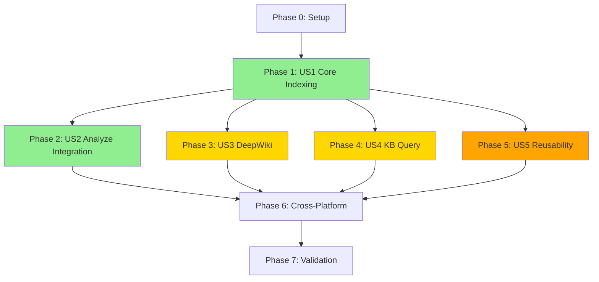

# Implementation Tasks: Codebase Indexing System

**Feature**: C00000-0001-codebase-indexing
**Branch**: `feature/C00000-0001-codebase-indexing`
**Generated**: 2025-01-25

## Task Format

```
- [ ] [TaskID] [P] [Story] Description (file: path/to/file.ext)
```

- **TaskID**: Unique identifier (T001, T002, etc.)
- **P**: Parallelizable marker (tasks that can run in parallel)
- **Story**: User story reference (US1-US5)
- **Priority**: Inherited from user story (P1, P2, P3)

---

## Phase 0: Project Initialization

### Setup & Configuration

- [X] [T001] [P] Add `.analysis/` directory to `.gitignore` (file: .gitignore)
- [X] [T002] [P] Add `.deepwiki/` directory to `.gitignore` (file: .gitignore)
- [X] [T003] [P] Create fixture projects for testing (dir: tests/fixtures/sample-projects/)
- [X] [T004] Update AGENTS.md with indexing technologies (file: CLAUDE.md)
- [X] [T005] [P] Create central OS detection utility returning platform type (unix/windows) (file: scripts/bash/detect-os.sh, scripts/powershell/Detect-OS.ps1)

---

## Phase 1: Foundation - User Story 1 (Priority: P1)
**Build Codebase Index for Fast Analysis**

### Core Slash Commands

- [X] [T101] [US1] Create `/speckitsmart.index` slash command template (file: templates/commands/index.md)
- [X] [T102] [US1] Implement prerequisite check script for hard dependency validation (file: scripts/bash/check-index-prerequisite.sh)
- [X] [T103] [US1] Implement prerequisite check script for hard dependency validation (file: scripts/powershell/Check-IndexPrerequisite.ps1)

### Core Indexing Scripts (Bash)

- [X] [T104] [US1] Create main indexing orchestration script (file: scripts/bash/build-codebase-index.sh)
- [X] [T105] [US1] Implement file scanner with language filtering (embedded in: scripts/bash/build-codebase-index.sh)
- [X] [T106] [US1] Implement code structure parser (classes, functions, interfaces) (embedded in: scripts/bash/build-codebase-index.sh)
- [ ] [T107] [US1] Implement data model extractor (Prisma, TypeORM, Django, Hibernate) (embedded in: scripts/bash/build-codebase-index.sh)
- [X] [T108] [US1] Implement API endpoint extractor (REST, GraphQL, WebSocket) (embedded in: scripts/bash/build-codebase-index.sh)
- [X] [T108.5] [US1] Implement WebSocket handler extractor (Socket.io, native WebSocket, ws library) (embedded in: scripts/bash/build-codebase-index.sh)
- [ ] [T109] [US1] Implement external API detector (third-party SDKs) (embedded in: scripts/bash/build-codebase-index.sh)
- [ ] [T110] [US1] Implement dependency graph builder (imports/exports) (embedded in: scripts/bash/build-codebase-index.sh)
- [ ] [T111] [US1] Implement secret redaction for sensitive data (embedded in: scripts/bash/build-codebase-index.sh)
- [X] [T112] [US1] Implement metadata generator with statistics (embedded in: scripts/bash/build-codebase-index.sh)
- [ ] [T112.5] [US1] Implement index version validation on load with compatibility checking (embedded in: scripts/bash/build-codebase-index.sh)
- [X] [T113] [US1] Implement incremental update with MD5 hash tracking and auto-fallback to full build when base index missing (embedded in: scripts/bash/build-codebase-index.sh)

### Core Indexing Scripts (PowerShell)

- [X] [T114] [US1] Create main indexing orchestration script (file: scripts/powershell/Build-CodebaseIndex.ps1)
- [X] [T115] [US1] Implement file scanner with language filtering (embedded in: scripts/powershell/Build-CodebaseIndex.ps1)
- [X] [T116] [US1] Implement code structure parser (classes, functions, interfaces) (embedded in: scripts/powershell/Build-CodebaseIndex.ps1)
- [ ] [T117] [US1] Implement data model extractor (Prisma, TypeORM, Django, Hibernate) (embedded in: scripts/powershell/Build-CodebaseIndex.ps1)
- [X] [T118] [US1] Implement API endpoint extractor (REST, GraphQL, WebSocket) (embedded in: scripts/powershell/Build-CodebaseIndex.ps1)
- [X] [T118.5] [US1] Implement WebSocket handler extractor (Socket.io, native WebSocket, ws library) (embedded in: scripts/powershell/Build-CodebaseIndex.ps1)
- [ ] [T119] [US1] Implement external API detector (third-party SDKs) (embedded in: scripts/powershell/Build-CodebaseIndex.ps1)
- [ ] [T120] [US1] Implement dependency graph builder (imports/exports) (embedded in: scripts/powershell/Build-CodebaseIndex.ps1)
- [ ] [T121] [US1] Implement secret redaction for sensitive data (embedded in: scripts/powershell/Build-CodebaseIndex.ps1)
- [X] [T122] [US1] Implement metadata generator with statistics (embedded in: scripts/powershell/Build-CodebaseIndex.ps1)
- [ ] [T122.5] [US1] Implement index version validation on load with compatibility checking (embedded in: scripts/powershell/Build-CodebaseIndex.ps1)
- [X] [T123] [US1] Implement incremental update with MD5 hash tracking and auto-fallback to full build when base index missing (embedded in: scripts/powershell/Build-CodebaseIndex.ps1)

### Index Storage Structure

- [X] [T124] [P] [US1] Create JSON schema for metadata.json (file: specs/C00000-0001-codebase-indexing/contracts/metadata-schema.json)
- [X] [T125] [P] [US1] Create JSON schema for structure.json (file: specs/C00000-0001-codebase-indexing/contracts/structure-schema.json)
- [X] [T126] [P] [US1] Create JSON schema for data-models.json (file: specs/C00000-0001-codebase-indexing/contracts/data-models-schema.json)
- [X] [T127] [P] [US1] Create JSON schema for api-endpoints.json (file: specs/C00000-0001-codebase-indexing/contracts/api-endpoints-schema.json)
- [X] [T128] [P] [US1] Create JSON schema for external-apis.json (file: specs/C00000-0001-codebase-indexing/contracts/external-apis-schema.json)
- [X] [T129] [P] [US1] Create JSON schema for dependencies.json (file: specs/C00000-0001-codebase-indexing/contracts/dependencies-schema.json)

### Testing

- [X] [T130] [US1] Create test suite for prerequisite checks (file: tests/indexing/test-prerequisite-checks.sh)
- [X] [T131] [US1] Create test suite for index building (file: tests/indexing/test-index-building.sh)
- [ ] [T132] [US1] Create test suite for data extraction algorithms (file: tests/indexing/test-data-extraction.sh)
- [ ] [T133] [US1] Create test suite for incremental updates (file: tests/indexing/test-incremental-update.sh)
- [ ] [T134] [US1] Create cross-platform compatibility tests (file: tests/indexing/test-cross-platform.sh)

---

## Phase 2: Analyze-Project Integration - User Story 2 (Priority: P1)
**Reverse Engineer Legacy Code with Index**

### Integration Scripts

- [ ] [T201] [US2] Create index data loader script for analyze-project (file: .specify/scripts/bash/load-index-for-analysis.sh)
- [ ] [T202] [US2] Create index data loader script for analyze-project (file: .specify/scripts/powershell/Load-IndexForAnalysis.ps1)
- [ ] [T203] [US2] Implement optional prerequisite check script (soft warning) (file: .specify/scripts/bash/check-index-optional.sh)
- [ ] [T204] [US2] Implement optional prerequisite check script (soft warning) (file: .specify/scripts/powershell/Check-IndexOptional.ps1)

### Command Modifications

- [X] [T205] [US2] Update `/speckitsmart.analyze-project` to add prerequisite check (file: templates/commands/analyze-project.md)
- [X] [T206] [US2] Update analyze-project workflow to load pre-extracted index data (file: templates/commands/analyze-project.md)
- [X] [T207] [US2] Add staleness warning logic for indexes >7 days old (file: templates/commands/analyze-project.md)

### Testing

- [ ] [T208] [US2] Create test suite for analyze-project integration (file: tests/indexing/test-analyze-integration.sh)
- [ ] [T209] [US2] Create performance benchmark tests (compare with/without index) (file: tests/indexing/benchmark-analyze-performance.sh)

---

## Phase 3: DeepWiki Documentation - User Story 3 (Priority: P2)
**Generate Comprehensive Documentation**

### Slash Commands

- [X] [T301] [US3] Create `/speckitsmart.wiki` slash command template (file: templates/commands/wiki.md)

### Documentation Generator Scripts (Bash)

- [ ] [T302] [US3] Create DeepWiki generator orchestration script (file: .specify/scripts/bash/generate-deepwiki.sh)
- [ ] [T303] [US3] Implement Tier 1 generator (overview.md) (embedded in: .specify/scripts/bash/generate-deepwiki.sh)
- [ ] [T304] [US3] Implement Tier 2 generator (functional-summary.md) (embedded in: .specify/scripts/bash/generate-deepwiki.sh)
- [ ] [T305] [US3] Implement Tier 3 generator (architecture diagrams) (embedded in: .specify/scripts/bash/generate-deepwiki.sh)
- [ ] [T306] [US3] Implement Tier 4 generator (per-module docs) (embedded in: .specify/scripts/bash/generate-deepwiki.sh)
- [ ] [T307] [US3] Implement API reference generator (REST/GraphQL) (embedded in: .specify/scripts/bash/generate-deepwiki.sh)
- [ ] [T308] [US3] Implement data model documentation generator (embedded in: .specify/scripts/bash/generate-deepwiki.sh)
- [ ] [T309] [US3] Implement Mermaid diagram generator (component, data flow) (embedded in: .specify/scripts/bash/generate-deepwiki.sh)

### Documentation Generator Scripts (PowerShell)

- [ ] [T310] [US3] Create DeepWiki generator orchestration script (file: .specify/scripts/powershell/Generate-DeepWiki.ps1)
- [ ] [T311] [US3] Implement Tier 1 generator (overview.md) (embedded in: .specify/scripts/powershell/Generate-DeepWiki.ps1)
- [ ] [T312] [US3] Implement Tier 2 generator (functional-summary.md) (embedded in: .specify/scripts/powershell/Generate-DeepWiki.ps1)
- [ ] [T313] [US3] Implement Tier 3 generator (architecture diagrams) (embedded in: .specify/scripts/powershell/Generate-DeepWiki.ps1)
- [ ] [T314] [US3] Implement Tier 4 generator (per-module docs) (embedded in: .specify/scripts/powershell/Generate-DeepWiki.ps1)
- [ ] [T315] [US3] Implement API reference generator (REST/GraphQL) (embedded in: .specify/scripts/powershell/Generate-DeepWiki.ps1)
- [ ] [T316] [US3] Implement data model documentation generator (embedded in: .specify/scripts/powershell/Generate-DeepWiki.ps1)
- [ ] [T317] [US3] Implement Mermaid diagram generator (component, data flow) (embedded in: .specify/scripts/powershell/Generate-DeepWiki.ps1)

### Testing

- [ ] [T318] [US3] Create test suite for DeepWiki generation (file: tests/indexing/test-wiki-generation.sh)
- [ ] [T319] [US3] Validate generated markdown structure and links (file: tests/indexing/test-wiki-validation.sh)

---

## Phase 4: Knowledge Base Querying - User Story 4 (Priority: P2)
**Query Codebase with Natural Language**

### Slash Commands

- [X] [T401] [US4] Create `/speckitsmart.ask` slash command template (file: templates/commands/ask.md)

### Query Engine Scripts (Bash)

- [ ] [T402] [US4] Create knowledge base search script (file: .specify/scripts/bash/search-knowledge-base.sh)
- [ ] [T403] [US4] Implement keyword-based search in index (embedded in: .specify/scripts/bash/search-knowledge-base.sh)
- [ ] [T404] [US4] Implement DeepWiki document search (optional) (embedded in: .specify/scripts/bash/search-knowledge-base.sh)
- [ ] [T405] [US4] Implement answer formatter with code references (embedded in: .specify/scripts/bash/search-knowledge-base.sh)
- [ ] [T406] [US4] Implement confidence scoring for answers (embedded in: .specify/scripts/bash/search-knowledge-base.sh)
- [ ] [T407] [US4] Implement source citation generator (embedded in: .specify/scripts/bash/search-knowledge-base.sh)

### Query Engine Scripts (PowerShell)

- [ ] [T408] [US4] Create knowledge base search script (file: .specify/scripts/powershell/Search-KnowledgeBase.ps1)
- [ ] [T409] [US4] Implement keyword-based search in index (embedded in: .specify/scripts/powershell/Search-KnowledgeBase.ps1)
- [ ] [T410] [US4] Implement DeepWiki document search (optional) (embedded in: .specify/scripts/powershell/Search-KnowledgeBase.ps1)
- [ ] [T411] [US4] Implement answer formatter with code references (embedded in: .specify/scripts/powershell/Search-KnowledgeBase.ps1)
- [ ] [T412] [US4] Implement confidence scoring for answers (embedded in: .specify/scripts/powershell/Search-KnowledgeBase.ps1)
- [ ] [T413] [US4] Implement source citation generator (embedded in: .specify/scripts/powershell/Search-KnowledgeBase.ps1)

### Testing

- [ ] [T414] [US4] Create test suite for knowledge base queries (file: tests/indexing/test-kb-queries.sh)
- [ ] [T415] [US4] Create test cases for common query patterns (file: tests/indexing/test-query-patterns.sh)
- [ ] [T416] [US4] Create validation test suite for all 6 question categories with sample questions (architecture/patterns, data models, API endpoints, external integrations, authentication flows, business logic) (file: tests/indexing/test-question-categories.sh)

---

## Phase 5: Code Reusability - User Story 5 (Priority: P3)
**Detect Code Reusability During Implementation**

### Reusability Scripts (Bash)

- [ ] [T501] [US5] Create reusable code finder script (file: .specify/scripts/bash/find-reusable-code.sh)
- [ ] [T502] [US5] Implement similarity scoring algorithm (embedded in: .specify/scripts/bash/find-reusable-code.sh)
- [ ] [T503] [US5] Implement utility function search (embedded in: .specify/scripts/bash/find-reusable-code.sh)
- [ ] [T504] [US5] Implement architecture pattern detector (embedded in: .specify/scripts/bash/find-reusable-code.sh)
- [ ] [T505] [US5] Implement test example finder (embedded in: .specify/scripts/bash/find-reusable-code.sh)

### Reusability Scripts (PowerShell)

- [ ] [T506] [US5] Create reusable code finder script (file: .specify/scripts/powershell/Find-ReusableCode.ps1)
- [ ] [T507] [US5] Implement similarity scoring algorithm (embedded in: .specify/scripts/powershell/Find-ReusableCode.ps1)
- [ ] [T508] [US5] Implement utility function search (embedded in: .specify/scripts/powershell/Find-ReusableCode.ps1)
- [ ] [T509] [US5] Implement architecture pattern detector (embedded in: .specify/scripts/powershell/Find-ReusableCode.ps1)
- [ ] [T510] [US5] Implement test example finder (embedded in: .specify/scripts/powershell/Find-ReusableCode.ps1)

### Command Integration

- [X] [T511] [US5] Update `/speckitsmart.implement` to add optional reusability checks (file: templates/commands/implement.md)
- [X] [T512] [US5] Implement warning message for missing index (file: templates/commands/implement.md)

### Testing

- [ ] [T513] [US5] Create test suite for code reusability detection (file: tests/indexing/test-reusability.sh)
- [ ] [T514] [US5] Validate similarity scoring accuracy (file: tests/indexing/test-similarity-scoring.sh)

---

## Phase 6: Cross-Platform & Quality

### Cross-Platform Compatibility

- [ ] [T601] [P] Update all slash commands to use central OS detection utility (T005) for platform routing (files: .claude/commands/index.md, wiki.md, ask.md)
- [ ] [T602] [P] Add `SPEC_KIT_PLATFORM` environment variable support (embedded in all scripts)
- [ ] [T603] [P] Ensure consistent JSON output across bash/PowerShell (all scripts)
- [ ] [T604] Test on Windows 10+ with PowerShell 5.1+ (manual validation)
- [ ] [T605] Test on macOS 10.15+ with Bash 4.0+ (manual validation)
- [ ] [T606] Test on Ubuntu 18.04+ with Bash 4.0+ (manual validation)

### Performance Optimization

- [ ] [T607] Benchmark index build time for <1K, 1K-10K, 10K-50K files (file: tests/indexing/benchmark-build-time.sh)
- [ ] [T608] Benchmark incremental update performance (file: tests/indexing/benchmark-incremental.sh)
- [ ] [T609] Optimize regex patterns for parsing speed (embedded in build scripts)
- [ ] [T610] Implement progress indicators for --verbose mode (embedded in build scripts)

### Error Handling & Edge Cases

- [ ] [T611] [P] Implement error handling for missing jq dependency (all scripts)
- [ ] [T612] [P] Implement error handling for corrupted index files (prerequisite check scripts)
- [ ] [T613] [P] Implement file size limit validation (10MB) (build scripts)
- [ ] [T614] [P] Implement syntax error fallback (continue on parse failure) (build scripts)
- [ ] [T615] [P] Implement circular dependency detection (dependency graph builder)

### Documentation

- [ ] [T616] [P] Update quickstart.md with final usage examples (file: specs/C00000-0001-codebase-indexing/quickstart.md)
- [ ] [T617] [P] Create indexing patterns reference (file: .specify/memory/indexing-patterns.md)
- [ ] [T618] [P] Update AGENTS.md with complete indexing section (file: .specify/templates/AGENTS.md)
- [ ] [T619] [P] Create large-project indexing guide for >50K files (manual batching strategies, subdirectory indexing, time estimates, memory considerations) (file: specs/C00000-0001-codebase-indexing/large-projects-guide.md)

---

## Phase 7: Final Validation & Launch

### Integration Testing

- [ ] [T701] Run end-to-end test: index → analyze-project workflow (manual validation)
- [ ] [T702] Run end-to-end test: index → wiki → ask workflow (manual validation)
- [ ] [T703] Run end-to-end test: index → implement with reusability (manual validation)
- [ ] [T704] Validate all success criteria (SC-001 through SC-015) (file: tests/indexing/validate-success-criteria.sh)

### Performance Validation

- [ ] [T705] Validate SC-001: Index build <60s for 1K-10K files (benchmark test)
- [ ] [T706] Validate SC-002: Incremental update <5s (benchmark test)
- [ ] [T707] Validate SC-004: 10x speedup for analyze-project (benchmark test)
- [ ] [T708] Validate SC-011: Index storage <1% of codebase (benchmark test)
- [ ] [T709] Validate SC-012: Memory usage <500MB for 50K files (benchmark test)

### Pre-Launch Checklist

- [ ] [T710] [P] Verify all 6 JSON schemas are valid and complete (contracts/ directory)
- [ ] [T711] [P] Verify .gitignore entries for `.analysis/` and `.deepwiki/`
- [ ] [T712] [P] Verify all bash scripts have executable permissions
- [ ] [T713] [P] Verify all PowerShell scripts follow naming conventions (Verb-Noun.ps1)
- [ ] [T714] Create release notes and migration guide (file: specs/C00000-0001-codebase-indexing/RELEASE_NOTES.md)

---

## Task Summary

**Total Tasks**: 121 tasks

**By Phase**:
- Phase 0 (Setup): 5 tasks
- Phase 1 (US1 - Core Indexing): 38 tasks
- Phase 2 (US2 - Analyze Integration): 9 tasks
- Phase 3 (US3 - DeepWiki): 19 tasks
- Phase 4 (US4 - Knowledge Base): 16 tasks
- Phase 5 (US5 - Reusability): 14 tasks
- Phase 6 (Cross-Platform & Quality): 19 tasks
- Phase 7 (Validation & Launch): 14 tasks

**By Priority**:
- P1 (Critical): 47 tasks (US1 + US2)
- P2 (High): 35 tasks (US3 + US4)
- P3 (Medium): 14 tasks (US5)
- Quality/Testing: 25 tasks

**Parallelizable Tasks**: 32 tasks marked with [P]

**Estimated Completion**:
- Phase 0: 1-2 days
- Phase 1 (US1): 7-10 days
- Phase 2 (US2): 2-3 days
- Phase 3 (US3): 5-7 days
- Phase 4 (US4): 4-5 days
- Phase 5 (US5): 3-4 days
- Phase 6: 3-5 days
- Phase 7: 2-3 days

**Total Estimated Time**: 27-39 working days (5.5-8 weeks)

---

## Dependency Graph



**Critical Path**: P0 → P1 → P2 → P6 → P7 (Core indexing and analyze-project integration)

**Parallel Work Opportunities**:
- Phase 3, 4, 5 can be developed in parallel after Phase 1 completes
- Bash and PowerShell implementations can be developed in parallel
- JSON schema creation tasks can be done in parallel
- Test suite creation can be done in parallel with implementation

---

## Notes

1. **[P] Marker**: Tasks marked with [P] can be executed in parallel with other [P] tasks in the same phase
2. **File Paths**: All file paths are relative to repository root
3. **Testing Strategy**: Each phase includes dedicated test tasks to validate functionality
4. **Cross-Platform**: Bash and PowerShell tasks are mirrored - implement one first, then adapt to other platform
5. **JSON Schemas**: Create all schemas early (T124-T129) to enable validation during development
6. **Performance**: Benchmark tasks (T607-T609, T705-T709) should be run continuously during development

---

## Implementation Recommendations

1. **Start with Phase 0**: Set up project structure and testing fixtures
2. **Focus on P1 User Stories First**: Complete US1 and US2 before moving to P2/P3 features
3. **Implement Bash First**: Develop bash scripts first, then port to PowerShell (or vice versa based on team expertise)
4. **Test Early and Often**: Run test suites after each component completion
5. **Validate Against Success Criteria**: Continuously check against SC-001 through SC-015
6. **Use Fixture Projects**: Test all extraction logic against real-world fixture projects in tests/fixtures/

---

**Next Steps**: Begin with Phase 0 tasks (T001-T004) to set up project structure and testing environment.
