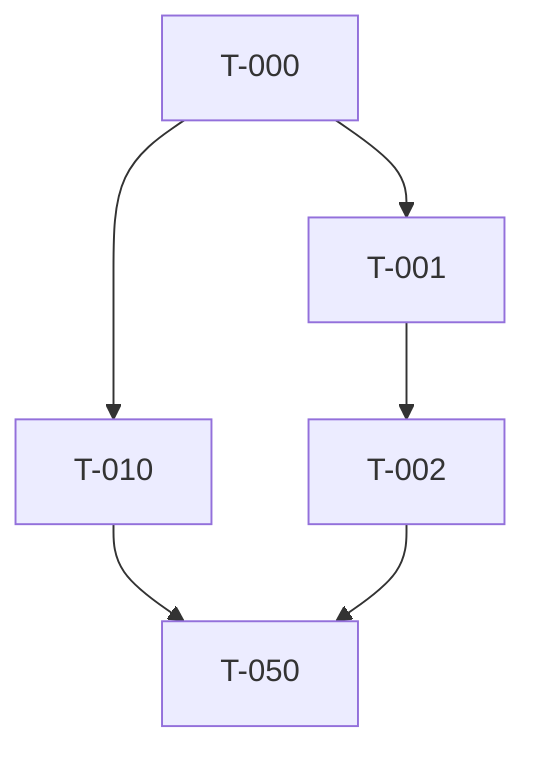

# Task Breakdown

Follow this format for every task entry:

```
[TaskID] [Priority] [Story] [Labels] [DependsOn: TaskIDs] Description (Definition of Done)
```

- **TaskID**: `T-###` sequential.
- **Priority**: `P1`, `P2`, … aligning with user journeys.
- **Story**: `US-01`, `US-02`, etc.
- **Labels**: comma-separated tags (e.g., `api,security`). Use `core` for blocking work.
- **DependsOn**: comma-separated task IDs; omit when empty.
- **Definition of Done**: explicit verification, tests, or deliverables.

## Readiness Checklist

- [ ] Foundation tasks cover shared infrastructure.
- [ ] Every user journey from the spec has ≥1 task.
- [ ] High risks from plan.md are mitigated by dedicated tasks.

## Foundational Tasks (Blocking)

[T-000] [P0] [CORE] [infrastructure] [] Establish project scaffolding (DoD: structure matches plan.md diagram)

## User Journey Slices

### US-01 – [Journey title]

Definition of Done for the story:
- Outcome 1
- Outcome 2

Tasks:
- [T-001] [P1] [US-01] [api] [] Implement endpoint … (DoD: contract test passes)
- [T-002] [P1] [US-01] [frontend] [DependsOn: T-001] Build UI flow … (DoD: UX checklist signed off)

### US-02 – [Journey title]

Definition of Done:
- …

Tasks:
- [T-010] [P2] [US-02] [data] [] …

## Cross-Cutting / Polish

- [T-050] [P3] [Cross] [qa] [DependsOn: T-001,T-010] Regression suite updated (DoD: CI run attached)

## Dependency Graph



Update the graph to reflect real dependencies. Ensure it contains every task ID exactly once.
